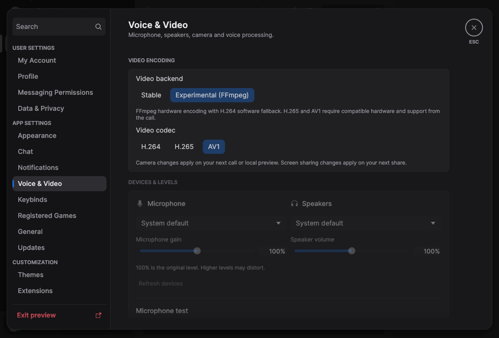
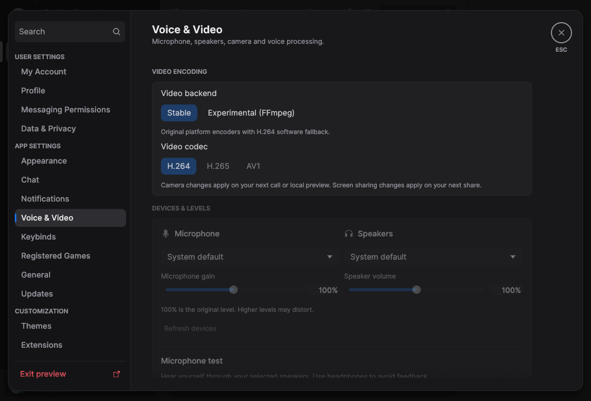
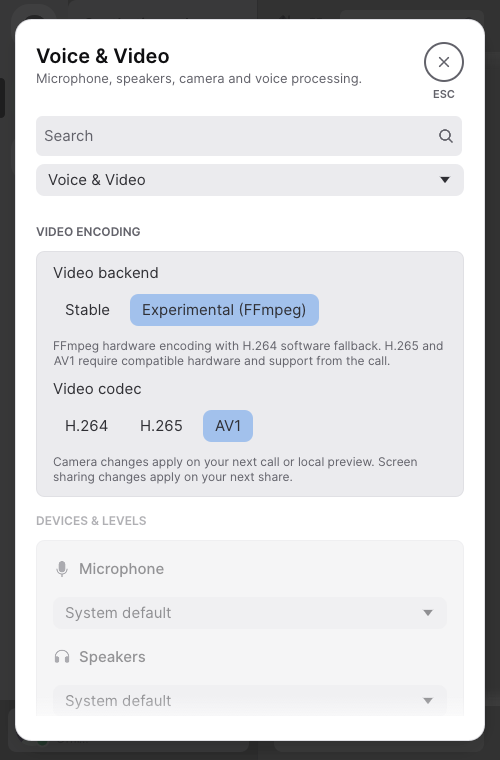

# Video backend and codec settings — October 5, 2026

Baseline is local commit `65811f20a7dea160ba4c78459c63dd339a794a5a` on
`feat/ffmpeg-video-encoding`, after the earlier FFmpeg/vendor changes. Remote
`main` remains `6313e27`; the branch contains all three implementation stages.
The verified standard DEB, executable, camera workload and native preview were
copied to a separate baseline directory before any new Cargo build.

Stable defaults to the original platform H.264 encoders and direct OpenH264
fallback. Experimental uses FFmpeg NVENC/AMF/QSV/VideoToolbox where supported.
H.264 has software fallback; H.265/AV1 require compatible hardware and explicit
negotiation. No H.264 bytes can be mislabeled as another codec. Receiving stays
H.264-only. Call requests, negotiation retries and screen-share requests carry
immutable settings snapshots; preview changes stop the current local preview.
Preferences are saved in the existing bounded device row, defaulting missing
fields to Stable/H.264. Switching to Stable resets the selected codec to H.264.

## Verification

`cargo xtask check` passed formatting, strict workspace/all-target Clippy,
1,183 passing test executions (27 ignored), the standard no-default-features check and
policy checks on Linux. Behavioral coverage includes real settings interaction,
legacy migration, persistence/rejection, call snapshots, Stable software decoding,
forced keyframes, codec capability/selection, DAVE and transport roundtrips,
HEVC/AV1 fragment reconstruction, MTU/size/count limits, codec-specific RTX and
wrong-codec local handshakes. A Stable fixture initially replaced an entire scene
each frame, triggering OpenH264's preserved scene detection; the corrected fixture
varies one pixel and verifies delta frames and explicit independently decodable IDRs.

The final native recipe registers exactly ten Linux encoders (H264/HEVC/AV1
NVENC+AMF+QSV plus OpenH264), no decoders or VA-API encoders. Native bundle checks
passed 11 tests with one Windows-only skip. Strict C11 warnings, ASan/UBSan/leak
checks cover 21 invalid/null requests, no codec substitution, owned-buffer/canary
limits, H.264 camera/screen decoding, HEVC/AV1 grammar and keyframe metadata,
NV12 conversion and forged backing lengths. Eighteen hardware option combinations
were checked on contexts without opening devices. The native prefix was rebuilt
with pinned sources after fixing FFmpeg 7.1.5's missing internal HEVC-QSV SEI helper;
Linux linking now rejects unresolved symbols. The exact patch and recipe ship with
corresponding source. Package/Flatpak fixture checks passed; license coverage is
reserved for the dedicated CI job.

## Synthetic native images

The baseline preview is the unchanged compiled 65811f2 fixture, launched with
`--demo --interactive --page=appearance --width=1120 --height=760`; the Voice &
Video sidebar was clicked at (100,412). `before.png` captures that page before
video encoding controls existed. New fixture CLI support can open `--page=voice`
and seed backend/codec values; it creates no media adapters or account session.
All captures use an isolated Xvfb display, scale 1 and the same synthetic state.
Dark at 1120×760 and light at the fixture's minimum width of 500×760 were
inspected. Native pointer interaction selects Experimental/H.265/AV1 and resets
to H.264 on Stable; wheel scrolling reaches Camera below the fold, and Escape
closes settings. The UI behavioral test independently exercises every selection.
These are development artifacts, excluded from runtime assets.

| Before | Experimental / AV1 | Stable | Light / narrow |
| --- | --- | --- | --- |
|  |  |  |  |

## Reproduction and measurement

Use the pinned Rust 1.98.1 toolchain and verified native prefix as `FFMPEG_DIR`.
The source builder is `python3 scripts/build-ffmpeg.py`; software/HW registrations
are recorded in its `build.json`. Standard release packaging uses `cargo xtask
package` with ordinary fat LTO, one codegen unit, stripping and voice enabled.
The preview fixture uses:

```sh
cargo rustc --release --locked -p serein --no-default-features --features demo \
  --example profile_preview -- -C lto=off
cargo test --release --locked -p discord-voice -p platform \
  --features winit/x11,winit/wayland --lib synthetic_camera_encode_workload --no-run
```

[measure.py](measure.py) uses the existing camera workload: deterministic
640×480 RGB input, 30 frame warmup and 300 timed encode/conversion/allocation
calls; one process warmup and five alternating measured pairs. The new ignored
Stable workload uses the same helper and data. No GPU device is available, so
these camera runs measure software encoding only. Native Voice & Video idle uses
1120×760, dark, Xvfb :88, forced and verified Mesa lavapipe Vulkan. Each launch
warms eight seconds on Appearance, clicks Voice & Video at (100,412), moves the
pointer to (1100,740), settles three seconds and samples CPU/RSS twenty times at
one second. Two fresh pairs reverse order. CPU is percent of one core; peak RSS
is sampled after warmup and settled RSS is the last five samples' median. Child
processes are listed separately. Rendering variation limits comparisons; no
startup/frame p95, real camera/screen/GPU speed, quality or end-to-end latency is
measured. Standard DEB sizes include shared libraries, source and notices;
installed bytes sum extracted regular files, excluding symlinks/allocation overhead.

Hardware drivers, physical camera/portal capture, live Discord H.265/AV1 playback,
AV1's final DAVE OBU size convention, Windows/macOS, actual Nix/Flatpak builds and
remote CI remain unverified. macOS Experimental has no AV1 backend in this pinned
recipe; Windows ARM64 is H.264 software-only in Experimental. SDK startup and
teardown may block despite bounded queues. All local activity uses synthetic data;
no live account, microphone, camera or desktop capture is opened.

## Measured release results

Raw samples, environment, binary hashes and final source fingerprints are in
[measurements.json](measurements.json). Package smoke passed for all 248 files.
The installed libraries, fifteen source/recipe/notice files and repository notices
were compared byte-for-byte with the final prefix/repository; recipe SHA-256 is
`3e6f390ecf333833313c7aaee760cd53ade18d741f535b17bdc32ee1d7538c59`.
Both ordinary and Niri synthetic Linux screen examples passed with Stable/H.264.
The harness status text was corrected to name Stable; strict example Clippy and
workspace formatting passed afterward.

| Metric / method | Baseline | After | Delta |
| --- | ---: | ---: | ---: |
| Standard executable, bytes | 85,704,880 | 85,746,216 | 41,336 / +0.05% |
| Installed regular files, bytes | 120,678,267 | 120,976,132 | 297,865 / +0.25% |
| Compressed DEB, bytes | 70,674,624 | 70,795,724 | 121,100 / +0.17% |
| FFmpeg software, 300 camera frames | 993.070 ms | 1,024.365 ms | 31.295 ms / +3.15% |
| Default: FFmpeg → Stable software, 300 frames | 1,070.348 ms | 961.377 ms | -108.971 ms / -10.18% |
| FFmpeg camera sampled peak RSS, median | 19.855 MiB | 20.391 MiB | 0.535 MiB / +2.70% |
| Default camera sampled peak RSS, median | 19.957 MiB | 22.145 MiB | 2.188 MiB / +10.96% |
| Voice & Video idle mean CPU, one core | 0.000% | 0.000% | 0.000 percentage points; below sampling resolution |
| Idle sampled peak RSS | 194.012 MiB | 193.664 MiB | -0.348 MiB / -0.18% |
| Idle settled RSS | 193.578 MiB | 193.082 MiB | -0.496 MiB / -0.26% |

FFmpeg elapsed ranges were 981.882..1120.076 ms before and
1000.103..1079.431 ms after. Its median increased 3.15%, with overlapping
ranges; no speed improvement is claimed. Both produce exactly 300 packets and
5,831,668 encoded bytes. The separate default-backend comparison measured
978.513..1289.284 ms before and 948.913..988.283 ms with Stable. Stable produces
300 packets and 5,830,468 bytes; its median is 10.18% lower in this set, but its
peak test-process RSS is 2.188 MiB higher. These are different encoder paths,
with different thread settings, and do not establish equivalent visual quality
or general speed. The baseline median drifted between the two pair sets; host
noise limits attribution. An initial set that overlapped the synthetic Linux
screen check was excluded and repeated after all compilation/checks stopped.

Idle CPU was below psutil's one-second sampling resolution in every sample.
The two baseline peak RSS runs were 194.012/193.145 MiB; after was
192.500/193.664 MiB. Small aggregate differences are within variation; no idle
CPU/RAM improvement is claimed. No child/helper processes were observed.
